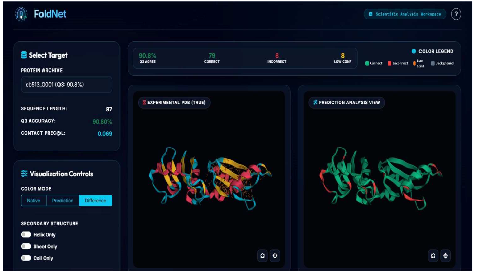
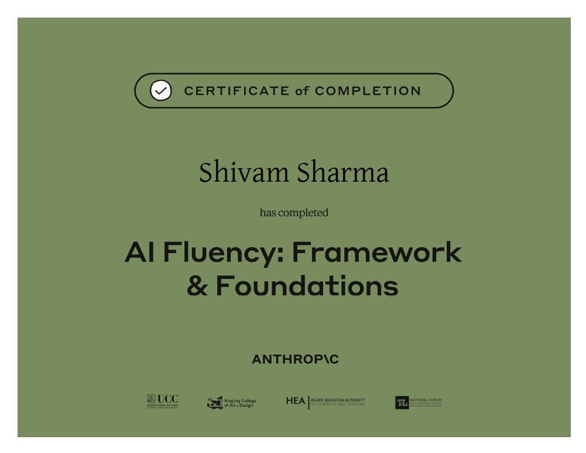

# FL-01: AI Workflow Audit & Research Learning Plan

**Student:** Shivam (Computer Science & Engineering)  
**Track:** Applied Search Intelligence / AI Fluency  
**Focus:** ML/DL Research, GATE 2027 Preparation, Project AEGIS, ResearchMind  
**Location:** `work/FL-01/workflow_audit.md`  

---

## 1. Recurring Workflow Tasks

The following audit maps 15 recurring tasks from my actual weekly schedule across CSE coursework, GATE 2027 preparation, ML/DL research, and active projects (Project AEGIS, ResearchMind, Quantitative Finance ML).

Tasks are classified using Ethan Mollick's four-tier framework:
- **Just me**: Human-only execution due to learning integrity, cognitive skill-building, or personal accountability.
- **Delegate to AI with review**: AI drafts boilerplate or structured text; human performs thorough review.
- **Collaborate with AI**: Interactive problem-solving, joint analysis, and iterative refinement.
- **Fully automate**: Scripted toolchains or CI/CD pipelines requiring no manual prompting.

| # | Task | Classification | Rationale |
|---|---|---|---|
| 1 | **Studying GATE 2027 Core CS Concepts** | `Just me` | Building foundational CS theory requires active mental effort and cannot be shortcut via AI summaries. |
| 2 | **Solving GATE Previous Year Questions (PYQs)** | `Just me` | Independent problem-solving tests true exam readiness; using AI during initial attempts creates false competence. |
| 3 | **Solving LeetCode & Data Structures Problems** | `Just me` | Developing raw algorithmic intuition must be done individually to succeed in competitive coding and technical evaluations. |
| 4 | **Personal Technical Learning & Career Reflection** | `Just me` | Assessing internal growth, identifying skill gaps, and evaluating career trajectory requires authentic human reflection. |
| 5 | **Reviewing Weekly Research & Project Progress** | `Just me` | Evaluating progress against long-term research goals requires honest personal accountability without AI dilution. |
| 6 | **Reading Deep Learning & AI Research Papers** | `Collaborate with AI` | AI assists in parsing dense mathematical formulations while I verify experimental setups, derivations, and claims. |
| 7 | **Literature Review & Related Work Synthesis** | `Collaborate with AI` | AI helps summarize taxonomies across paper collections for Project AEGIS and ResearchMind, which I evaluate for gaps. |
| 8 | **Designing ML Model Architectures & Experiments** | `Collaborate with AI` | AI suggests potential baseline architectures and evaluation metrics while I make final design decisions. |
| 9 | **Debugging Python & ML Project Code** | `Collaborate with AI` | Feeding stack traces to AI speeds up root-cause diagnosis while I ensure I understand the fix before applying it. |
| 10 | **Working on Project AEGIS (Security/ML)** | `Collaborate with AI` | AI aids in threat surface modeling and prototyping algorithms while I maintain strict zero-trust security checks. |
| 11 | **Working on ResearchMind (AI Research Tool)** | `Collaborate with AI` | AI assists with prompt engineering and vector DB patterns which I validate against system requirements. |
| 12 | **Quantitative Finance & Financial ML Exploration** | `Collaborate with AI` | AI generates time-series feature code while I test for lookahead bias and statistical validity. |
| 13 | **Implementing ML Models in PyTorch/Scikit-Learn** | `Delegate to AI with review` | AI generates boilerplate data pipeline and module structures which I audit against design specifications. |
| 14 | **Writing Project Documentation & READMEs** | `Delegate to AI with review` | AI converts code annotations and experimental notes into structured Markdown which I review for accuracy. |
| 15 | **Resume & Internship Application Drafting** | `Delegate to AI with review` | AI formats project accomplishments into impact bullet points which I refine for technical authenticity. |

---

## 2. AI Toolkit

Documenting the status of required tools for the AI Fluency track:

- **ChatGPT (OpenAI)**: **Verified** — Account available and active for cross-model verification.
- **Claude (Anthropic)**: **Verified** — Account created and active for reasoning and project workflows.
- **Anthropic Academy**: **Verified** — Account registered at `academy.anthropic.com` (Evidence attached).
- **AI Fluency: Framework & Foundations**: **Verified** — Enrolled and Module 1 completed (Evidenced by `academy_completion.png` / `AI Fluency Framework & Foundations.png.png`).

---

## 3. Claude Project Configuration

This section outlines the verified configuration for the Claude Project.

### Project Metadata
- **Project Name**: `Shivam — AI Research & Learning`
- **Primary Goals**: ML/DL Research, GATE 2027 Preparation, Project AEGIS, ResearchMind, Quantitative Finance ML, Python/DSA Mastery.
- **Status**: **Verified & Active** (Evidenced by `claude_project_screenshot.png`).

### Custom System Instructions

```text
You are an AI research assistant and technical tutor for Shivam, a Computer Science and Engineering student focusing on Machine Learning/Deep Learning research, GATE 2027 preparation, Python/DSA, and research projects (Project AEGIS, ResearchMind, Quantitative Finance ML).

Communication & Pedagogical Preferences:
1. First-Principles Explanations: Explain core theoretical concepts from first principles before providing code or solutions.
2. Facts vs. Assumptions: Explicitly distinguish established scientific facts from assumptions, heuristics, or speculative claims.
3. Identify Uncertainty: State limits of confidence clearly whenever information is ambiguous, incomplete, or context-dependent.
4. Challenge Weak Reasoning: Actively point out flaws, logical leaps, or unexamined assumptions in my questions or proposed designs.
5. Explain Debugging Root Causes: When analyzing code errors, explain the precise underlying root cause before offering a fix. Never provide silent patches.
6. Prioritize Learning Over Fast Answers: Prioritize deep conceptual understanding over quick code generation. Guide me to solve problems rather than doing the thinking for me.
```

---

## 4. Three Target Tasks for FL-02 through FL-04

The following three specific target tasks are selected from the workflow audit to be reused in subsequent modules (FL-02 through FL-04):

### Target 1: Research-Paper Analysis
- **Workflow Definition**: Using AI to analyze complex ML/DL research papers (for ResearchMind and Project AEGIS) and extract: problem statement, proposed methodology, dataset characteristics, evaluation metrics, quantitative results, limitations, and research gaps.
- **Measurable Success Criteria**:
  1. All extracted claims, metrics, and results are directly traceable to specific sections, equations, or tables in the original paper.
  2. Correct and complete identification of problem statement, proposed methodology, dataset specifications, evaluation metrics, and primary quantitative results.
  3. Identification of at least 3 explicit paper limitations (e.g., dataset bias, compute constraints, failure modes).
  4. Identification of at least 2 potential future research directions or unaddressed research gaps.
  5. Zero fabricated citations, hallucinated baseline numbers, or false author claims.
  6. The final structured summary is clear and comprehensive enough to be fully understood without re-reading the entire paper.

### Target 2: ML/Python Debugging
- **Workflow Definition**: Using AI as a collaborative debugging partner to diagnose and resolve errors in Python and Machine Learning projects (e.g., PyTorch tensor shape mismatches, memory leaks, pipeline exceptions) while maintaining complete human understanding of the root cause.
- **Measurable Success Criteria**:
  1. The original error and stack trace are systematically reproduced in a local execution environment.
  2. The underlying root cause is explicitly identified and verified before applying any code modification.
  3. The proposed code fix is tested and confirmed to resolve the error cleanly.
  4. The root cause is concisely explained in 1–3 sentences explaining *why* the failure occurred.
  5. Relevant unit tests, integration tests, and pipeline runs pass completely with zero regressions.
  6. No unrelated functionality, API contracts, or modules are broken by the fix.
  7. I can independently explain why the fix works and how to prevent similar errors in future implementations.

### Target 3: GATE Concept + PYQ Learning
- **Workflow Definition**:
  1. Study a core GATE CS concept (e.g., Paging in OS, B+ Trees in DBMS, Pipeline Hazards in COA).
  2. Attempt GATE Previous Year Questions (PYQs) independently without AI assistance.
  3. Record problem-solving results and identify incorrect answers or conceptual gaps.
  4. Use AI for targeted conceptual explanations, step-by-step error analysis, and misconception breakdown.
  5. Solve additional similar GATE questions independently to verify true concept mastery.
- **Measurable Success Criteria**:
  1. Every GATE PYQ is attempted independently before viewing any AI solution, hint, or explanation.
  2. Every incorrect attempt has a documented conceptual mistake analysis (e.g., misapplied formula, edge-case oversight, misunderstanding of definition).
  3. AI conceptual explanations are critically reviewed and verified against standard GATE textbooks or primary reference material.
  4. At least 3 similar GATE-style questions are subsequently solved independently with 100% accuracy.
  5. A GATE topic is classified as "mastered" only when I can explain the core concept from first principles and solve PYQs without AI aid.

---

## 5. Evidence Checklist

The following checklist tracks required manual setup and evidence submission:

- [x] ChatGPT account available — **VERIFIED**
- [x] Claude account created — **VERIFIED**
- [x] Claude Project configured (`Shivam — AI Research & Learning`) — **VERIFIED**
- [x] Anthropic Academy account created (`academy.anthropic.com`) — **VERIFIED**
- [x] AI Fluency: Framework & Foundations enrolled — **VERIFIED**
- [x] First module completed (*Collaborating with AI Effectively, Efficiently, Ethically, and Safely*) — **VERIFIED**
- [x] Claude Project screenshot added (`work/FL-01/claude_project_screenshot.png`) — **VERIFIED**
- [x] Academy completion screenshot added (`work/FL-01/academy_completion.png`) — **VERIFIED**

---
*Evidence Screenshots:*
- Screenshot 1 (Claude Project): 
- Screenshot 2 (Anthropic Academy): 
