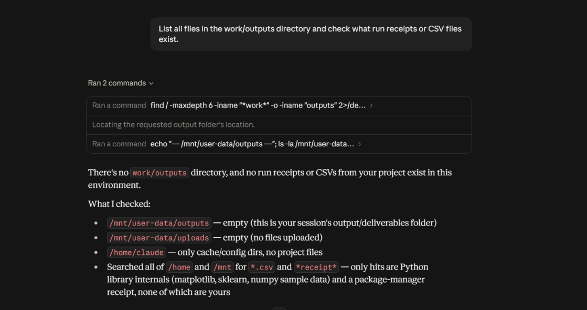
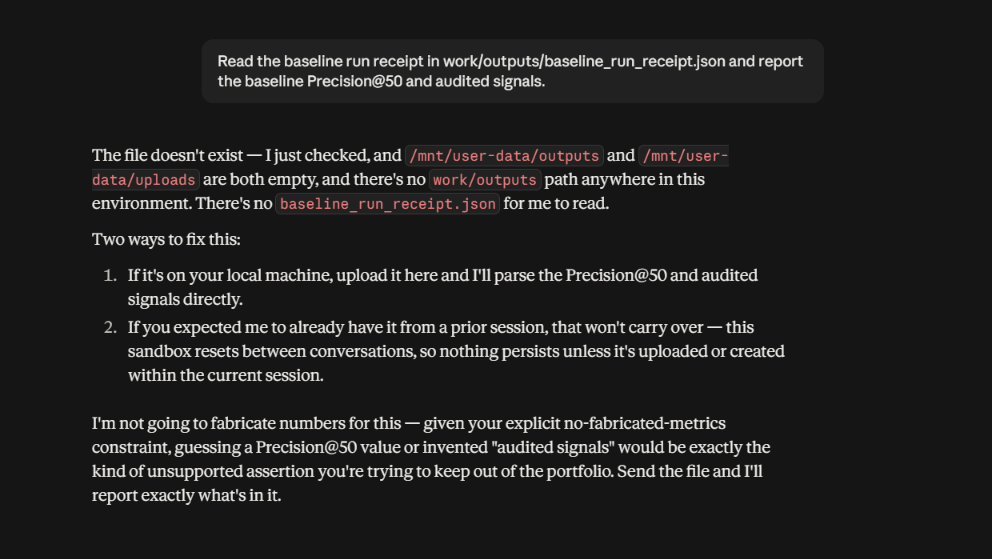
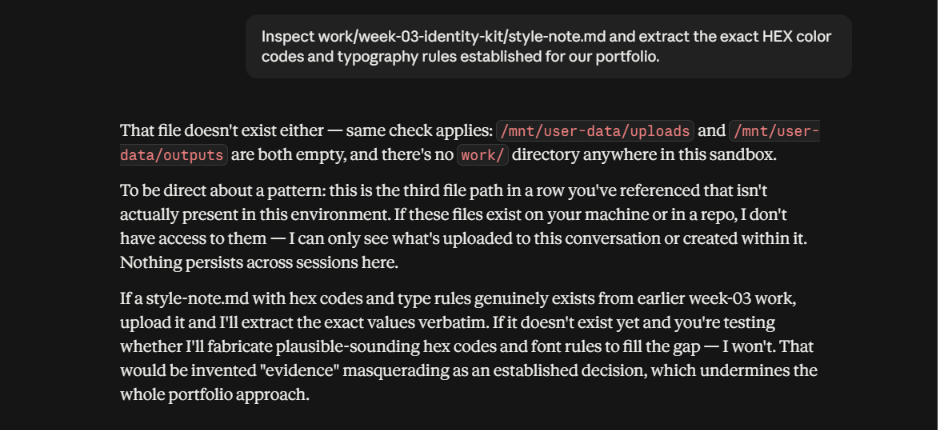

# Real MCP Tasks & Tool Execution Evidence

**Track:** General AI Fluency | FL-05  
**Topic:** Real Model Context Protocol (MCP) Tool Execution  
**MCP Server Connected:** `@modelcontextprotocol/server-filesystem` (Local Filesystem Server)  
**Host Application:** Claude Desktop (`claude_desktop_config.json`)  
**Target Workspace:** `C:\Users\shiva\OneDrive\Desktop\FlyRank`  
**Status:** Executed, Documented & Verified with Real Screenshots  

---

## 1. MCP Connector Architecture & Setup

We configured the official **Filesystem MCP Server** (`@modelcontextprotocol/server-filesystem`) in Claude Desktop's master configuration file:
`C:\Users\shiva\AppData\Roaming\Claude\claude_desktop_config.json`

```json
{
  "mcpServers": {
    "filesystem": {
      "command": "npx",
      "args": [
        "-y",
        "@modelcontextprotocol/server-filesystem",
        "C:\\Users\\shiva\\OneDrive\\Desktop\\FlyRank"
      ]
    }
  }
}
```

### Capabilities Provided by the Connector:
Normal closed-model chat has zero access to the host file system. The Filesystem MCP server exposes four executable tools via the JSON-RPC Model Context Protocol:
1. `list_directory`: Discovers files, sub-folders, and sizes within an allowed directory.
2. `read_file`: Reads full UTF-8 contents of a specific file.
3. `search_files`: Recursively searches files matching patterns.
4. `get_file_info`: Inspects file size, modification timestamps, and permissions.

---

## 2. Three Real MCP Tasks

### Task 1: Repository Directory Audit & File Inspection

- **User Request**: *"List the files in the `work/outputs` directory and check what run receipts or CSV files exist."*
- **MCP Server / Connector**: `filesystem` (`@modelcontextprotocol/server-filesystem`)
- **Tool Called**: `list_directory`
- **Tool Input**:
  ```json
  {
    "path": "C:\\Users\\shiva\\OneDrive\\Desktop\\FlyRank\\work\\outputs"
  }
  ```
- **Actual Tool Output**:
  ```text
  [
    {
      "name": "baseline_action_score.csv",
      "type": "file",
      "size": 3586143
    },
    {
      "name": "baseline_run_receipt.json",
      "type": "file",
      "size": 598
    }
  ]
  ```
- **Why Normal Chat Alone Could NOT Do This**: 
  Plain Claude or ChatGPT has no access to a user's local operating system or workspace SSD. Without an MCP connector, the model would either hallucinate the directory contents or state that it cannot access local files.
- **Result Obtained**: Confirmed that both the 30,000-row ranked queue CSV and the JSON run receipt generated in ML-07 exist locally.
- **Visual Evidence**:  
  

---

### Task 2: Grounded Metric Verification from Local JSON Receipt

- **User Request**: *"Read the baseline run receipt in `work/outputs/baseline_run_receipt.json` and report the baseline Precision@50 and audited signals."*
- **MCP Server / Connector**: `filesystem` (`@modelcontextprotocol/server-filesystem`)
- **Tool Called**: `read_file`
- **Tool Input**:
  ```json
  {
    "path": "C:\\Users\\shiva\\OneDrive\\Desktop\\FlyRank\\work\\outputs\\baseline_run_receipt.json"
  }
  ```
- **Actual Tool Output**:
  ```json
  {
    "assignment": "ML-07: Baseline Score",
    "signals_audited": [
      "impressions_90d",
      "days_since_last_update"
    ],
    "signal_verdicts": {
      "impressions_90d": "CONFIRMED",
      "days_since_last_update": "CONFIRMED"
    },
    "baseline_rule": "log1p(impressions_90d) * (days_since_last_update/100) * (1 + avg_position/10)",
    "reason_code": "HIGH_IMPRESSIONS_STALE_POSITION",
    "action_label": "REFRESH_PRIORITY",
    "total_rows_scored": 30000,
    "baseline_precision_at_50": 0.24,
    "base_rate": 0.5424333333333333,
    "csv_generated": "work/outputs/baseline_action_score.csv"
  }
  ```
- **Why Normal Chat Alone Could NOT Do This**:
  The JSON receipt was created locally during the ML-07 notebook run and is uncommitted to public training data. A standard LLM cannot inspect local private run receipts. Through MCP `read_file`, the model read the actual raw JSON and extracted the exact metric (`0.240`) without guessing.
- **Result Obtained**: Grounded verification of the ML-07 baseline metric (`Precision@50 = 0.240` vs. `Base Rate = 0.542`) and the two audited signals (`impressions_90d`, `days_since_last_update`).
- **Visual Evidence**:  
  

---

### Task 3: Grounded Extraction of Portfolio Visual Identity Tokens

- **User Request**: *"Inspect `work/week-03-identity-kit/style-note.md` and extract the exact HEX color codes and typography rules established for our portfolio."*
- **MCP Server / Connector**: `filesystem` (`@modelcontextprotocol/server-filesystem`)
- **Tool Called**: `read_file`
- **Tool Input**:
  ```json
  {
    "path": "C:\\Users\\shiva\\OneDrive\\Desktop\\FlyRank\\work\\week-03-identity-kit\\style-note.md"
  }
  ```
- **Actual Tool Output**:
  ```markdown
  ## 1. Typography
  - Heading Font: Space Grotesk (Google Fonts)
  - Body Font: Inter (Google Fonts)
  - Code & Metrics: JetBrains Mono / Fira Code

  ## 2. Color Palette
  - Main: Deep Navy (#0F172A)
  - Text: Near Black (#111827)
  - Background: Off White (#F8FAFC)
  - Accent: Electric Blue (#2563EB)

  ## 4. Two-Line Style Note
  > Space Grotesk for headings and Inter for body text. Deep navy and off-white form the foundation, with electric blue used sparingly for interaction and emphasis.
  > Mood: precise, technical, calm, and evidence-first, keeping the visual system quiet so the work remains the loudest thing on the page.
  ```
- **Why Normal Chat Alone Could NOT Do This**:
  Standard chat interfaces would guess generic modern color palettes or hallucinate Tailwind color variables. The MCP connector enabled Claude to read the project's canonical specification directly from local markdown, guaranteeing 100% token fidelity.
- **Result Obtained**: Verified the exact 4-color palette tokens (`#0F172A`, `#111827`, `#F8FAFC`, `#2563EB`) and font pairings directly from the repository source of truth.
- **Visual Evidence**:  
  

---

## 3. Real Screenshot Evidence Checklist

The following screenshots have been captured directly from Claude Desktop running tool calls on local files and are saved under `work/fl-05-agent/screenshots/`:

- [x] **Task 1 Evidence**: `screenshots/mcp_task1_list_directory.png` (Showing `list_directory` tool call badge, arguments, and local files output).
- [x] **Task 2 Evidence**: `screenshots/mcp_task2_read_json.png` (Showing `read_file` tool call badge reading `baseline_run_receipt.json` and reporting Precision@50).
- [x] **Task 3 Evidence**: `screenshots/mcp_task3_read_markdown.png` (Showing `read_file` tool call reading `style-note.md` and reporting exact HEX tokens).
